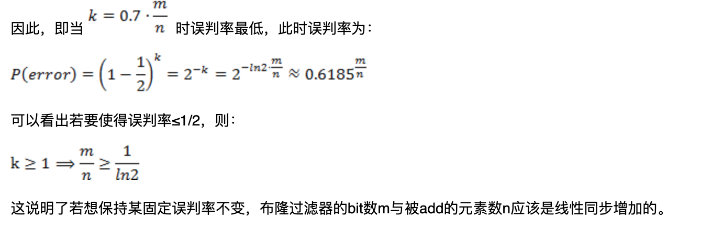
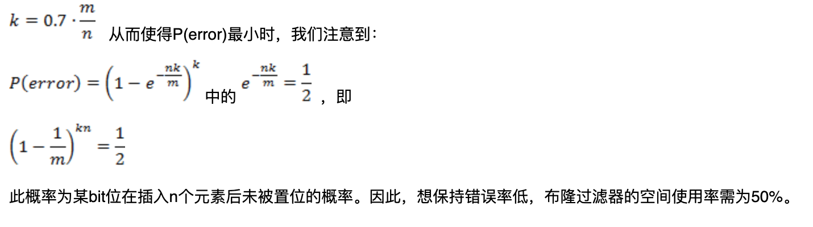

# 布隆过滤器

参考

[Allen Sun的技术博客: 原理推导](http://www.cnblogs.com/allensun/archive/2011/02/16/1956532.html)

[Bloom Filter 用例介绍](https://www.cnblogs.com/liyulong1982/p/6013002.html)

## 基本介绍

布隆过滤器是一种概率型数据结构（probabilistic data structure），可以实现高效的插入和查找，但不可进行删除，有一定的概率误判（当判断元素是否存在时，实际不存在，有一定的概率误判为存在）。

## 插入

**hash之后将对应的bit位全部设置成1**

一个初始的布隆过滤器是一个bit数组，或者位图，每一位都是0。通过k个hash函数计算需要插入元素的hash值，然后将bit数组对应的位置1，**如果原来这些位已经是1，那么保持不变**。

以下演示用8位存储的布隆过滤器，3个hash函数：hash1，hash2，hash3

**一个初始状态的布隆过滤器，8位，从右到左分别是bit0，bit1，...，bit7**

**插入第一个元素，hash之后分别为6，2，5，将对应的bit位置1**

**插入第二个元素，hash之后分别为5，1，3 将对应的bit位置1**

## 查找

- **存在：hash之后将对应的bit位全部为1**
- **不存在：hash之后将对应的bit位存在0**

- 现在查找item1，那么计算出来的hash值分别是6，2，5，发现对应位上都是1，返回存在
- 如果查找item3，如果计算出来的hash值分别是6，2，0，发现对应的位上存在0，那么返回不存在
- 如果查找item4，那么计算出来的hash值分别是6，5，2，发现对应位上都是1，返回存在（**误判**）

## 删除

**布隆过滤器不允许删除**，比如要删除item1，那么如果将6，2，5上位重置为0，这时候查找imte2的时候就会返回不存在

## 数学原理

**布隆过滤器的原理在[Allen Sun的技术博客](http://www.cnblogs.com/allensun/archive/2011/02/16/1956532.html) 第四部分“误判概率的证明和计算”中详细的进行了推导，这里仅复制下[Allen Sun的技术博客](http://www.cnblogs.com/allensun/archive/2011/02/16/1956532.html)的技术博客，如果涉及到侵权，请联系我删除。**

 
 
 
 

## 设计和应用布隆过滤器的方法

**设计和应用布隆过滤器的方法在[Allen Sun的技术博客](http://www.cnblogs.com/allensun/archive/2011/02/16/1956532.html) 第五部分“设计和应用布隆过滤器的方法”中详细的进行了推导，这里仅复制下[Allen Sun的技术博客](http://www.cnblogs.com/allensun/archive/2011/02/16/1956532.html)的技术博客，如果涉及到侵权，请联系我删除。**

 
 
 

## 应用

- redis 提供了布隆过滤器的命令
- [Google 著名的分布式数据库 Bigtable 使用了布隆过滤器来查找不存在的行或列，以减少磁盘查找的IO次数](https://www.cnblogs.com/liyulong1982/p/6013002.html)

