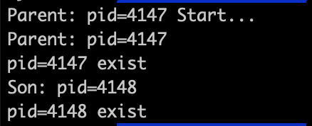
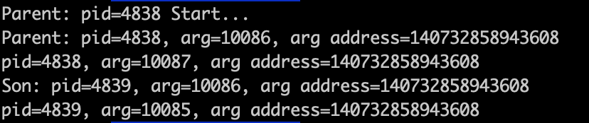

# Linux fork 函数

参考：

[cnblogs](https://www.cnblogs.com/dongguolei/p/8086346.html)

[csdn](https://blog.csdn.net/gogokongyin/article/details/51178257)

[csdn](https://blog.csdn.net/gogokongyin/article/details/51334773)


进程的四要素：

1. 有一段可执行的程序
2. 有自己的专用系统堆栈空间（
3. 有进程控制块（task_struct）（“有身份证，PID”）
4. 有独立的存储空间

缺少第四条的称为线程，如果完全没有用户空间称为内核线程，共享用户空间的称为用户线程。

## fork 函数

fork函数通过系统调用将运行着的程序分成2个完全一样的进程，每个进程都启动一个从代码的当前位置开始执行的线程。

fork 函数调用成功会返回2个值：

- 父进程返回子进程的进程id；子进程返回0。
- 如果调用失败，会返回-1。


```c
#include"stdio.h"
#include <unistd.h>

int main() {
    printf("Parent: pid=%d Start...\n", getpid());
    pid_t pid = fork();
    if (pid > 0) {
        printf("Parent: pid=%d\n", getpid());
    } else if (pid == 0) {
        printf("Son: pid=%d\n", getpid());
    } else {
        printf("fork failed, pid=%d\n", getpid());
    }
    printf("pid=%d exist\n", getpid());
    return 0;
}
```

运行结果：



从运行结果来看，pid=4147的进程开始运行，然后调用fork函数，生成子进程4148，然后各自从fork之后的地方往下执行。

fork创建的子进程是父进程的副本，它将获得父进程数据空间、堆、栈等资源的副本。

## 写时复制技术

写时复制技术：Copy-On-Write， COW

linux为了提高fork的效率，采用了copy-on-write技术，fork后，**这两个虚拟地址实际上指向相同的物理地址。（内存页），只有任何一个进程试图修改这个虚拟地址里的内容前，两个虚拟地址才会指向不同的物理地址**。新的物理地址的内容从源物理地址中复制得到。

为什么要采用COW技术呢，这和exec系列函数有关。

可以在[这里](https://blog.csdn.net/gogokongyin/article/details/51334773)了解exec相关信息

也就是说fork之后，父进程和子进程共享数据，但是有写操作的时候会复制一份，这样子看起来，就相当于fork调用“复制”了父进程的资源。

```c
#include"stdio.h"
#include <unistd.h>

int main() {
    int arg = 10086;
    printf("Parent: pid=%d Start...\n", getpid());
    pid_t pid = fork();
    if (pid > 0) {
        printf("Parent: pid=%d, arg=%d, arg address=%ld\n", getpid(), arg, &arg);
        arg = 10087;
    } else if (pid == 0) {
        printf("Son: pid=%d, arg=%d, arg address=%ld\n", getpid(), arg, &arg);
        arg = 10085;
    } else {
        printf("fork failed, pid=%d\n", getpid());
    }
    printf("pid=%d, arg=%d, arg address=%ld\n", getpid(), arg, &arg);
    return 0;
}
```

运行结果：



可以看到变量arg的地址，fork之后，即使父进程和子进程都修改arg变量值，但是地址都未发生变化，因为我们看到的都是虚拟地址，父进程和子进程修改这个变量时，都执行写时复制操作，虚拟地址不变。


