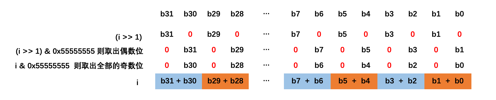
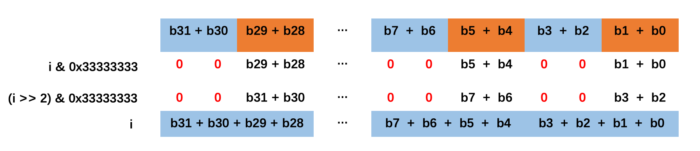
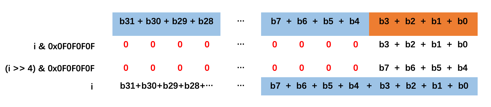
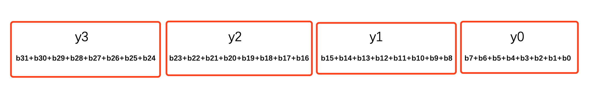
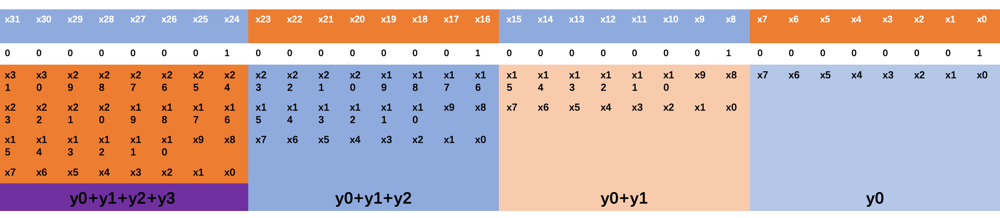

# variable-precision SWAR 算法

## Hamming Weight

计算二进制表示的数字中位1的数量，叫做汉明重量（Hamming Weight）

## 遍历算法

**时间复杂度是O(n)**

遍历算法就是通过一位运算，计算二进制数字中1的个数

```c
int hammingWeight(int number) {
    int result = 0;
    while (number != 0) {
        result += (number & 0x1);
        number = number >> 1;
    }
    return result;
}
```

比如计算8位表示的二进制数字，需要8次循环

32位表示的二进制数字，需要32次循环

缺点是：随着输入数字的增大，需要循环的次数越来越多

优点是：算法简单，不需要额外的空间

## 查表算法

**时间复杂度是O(n)**

查表算法的时间复杂度也是O(n)，但是有一个常数项的提升

比如在内存中维护这样一张表

| 十进制 | 二进制 | 汉明重量 |
| :---: | :---:  | :---:  |
| 0 | 0000 | 0 |
| 1 | 0001 | 1 |
| 2 | 0010 | 1 |
| 3 | 0011 | 2 |
| 4 | 0100 | 1 |
| 5 | 0101 | 2 |
| 6 | 0110 | 2 |
| 7 | 0111 | 3 |


那么8位表示的二进制，只需要查2次；32位表示的只需要查8次

效率提升了4倍

显然这张表越大，提升的越多

缺点是：典型的空间换时间


## variable-precision SWAR 算法

时间复杂度：O(1)

### 32位长度的 variable-precision SWAR 算法

```c
int swar(int i) {
    i = (i & 0x55555555) + ((i >> 1) & 0x55555555);
    i = (i & 0x33333333) + ((i >> 2) & 0x33333333);
    i = (i & 0x0F0F0F0F) + ((i >> 4) & 0x0F0F0F0F);
    i = (i * 0x01010101) >> 24;
    return i;
}
```

### 第一行把二进制2位分成一组，计算出1的个数

0x5555 5555 ==> 01010101 01010101 01010101 01010101

i & 0x55555555  则取出全部的奇数位；(i >> 1) & 0x55555555 则取出偶数位。



**注意：这一步相加的结果，不会往上进位**
 
假设i是偶数，i=(0,2,4,...,28,30)，(i+1)=(1,3,5,...,29,31)
 
因为 (0 b(i+1)) + (0 b(i)) 只有3种情况：

|0 b(i+1)|0 b(i)|b(i+1)+b(i)|
|:---:|:---:|:---:|
|00|00|00|
|00|01|01|
|01|00|01|
|01|01|10|


### 第二行把二进制4位分成一组，计算出1的个数

0x3333 3333 ==> 00110011 00110011 00110011 00110011



**注意：这一步相加的结果，也不会往上进位**

根据第一步结果可知，b(i+1)+b(i) 最大值用两位表示就是 10（二进制）

那么 b(i+3)+b(i+2)+b(i+1)+b(i)的最大值用四位表示足够了（用4位二进制表示的话，最大值是10+10=0100）

### 第三行把二进制8位分成一组，计算出1的个数

0x0F0F 0F0F ==> 00001111 00001111 00001111 00001111



**注意：这一步相加的结果，也不会往上进位**

根据第二步结果来看， b(i+3)+b(i+2)+b(i+1)+b(i) 用4位表示足够了，并且最高位一定为0

那么 b(i+7)+b(i+6)+b(i+5)+b(i+4)+b(i+3)+b(i+2)+b(i+1)+b(i) 用8位表示足够了（用8位二进制表示，最大值位0100 + 0100=00001000）

### 第四行计算结果存在高8位，计算出1的个数

用x(7)x(6)x(5)x(4)x(3)x(2)x(1)x(0)表示8位计算结果 b(7)+b(6)+b(5)+b(4)+b(3)+b(2)+b(1)+b(0) ，以此类推

根据第三步的计算结果，用y3，y2，y1，y0表示第三步后i的32位数字

y3=x(31)x(30)x(29)x(28)x(27)x(26)x(25)x(24)

y2=x(23)x(22)x(21)x(20)x(19)x(18)x(17)x(16)

y1=x(15)x(14)x(13)x(12)x(11)x(10)x(9)x(8)

y0=x(7)x(6)x(5)x(4)x(3)x(2)x(1)x(0)

根据第三步的推断 y0，y1，y2，y3 的最大值是：00001000


如下图所示：



**一个二进制有多少个1，只需要计算y0+y1+y2+y3即可**

以下是计算过程：

i * 0x01010101（0x01010101==>00000001 00000001 00000001 00000001）



其中结果中:

第一个8位为y0

第二个8位y0+y1，最大值为00001000 + 00001000 = 00010000，不会往上进位

第三个8位y0+y1+y2，最大值为00001000 + 00001000 + 00001000 = 00011000，不会往上进位

第四个8位y0+y1+y2+y3，最大值为为00001000 + 00001000 + 00001000 + 00001000 = 00100000，不会往上进位

至于32位以上的结果，可以不管，所以结果在高8位中，取出高8位（右移24位）

用 variable-precision SWAR 计算一个大的二进制数据的汉明重量的方法：每32个位计算一次汉明重量。


