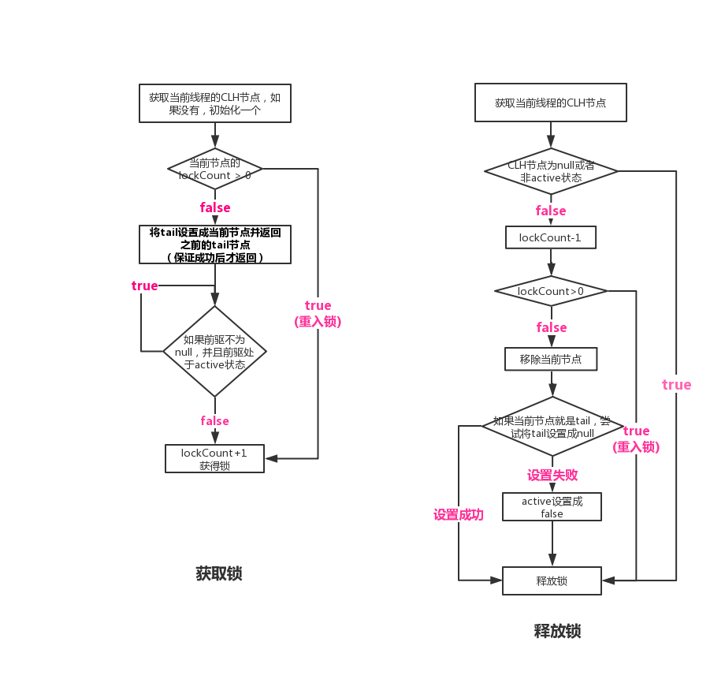
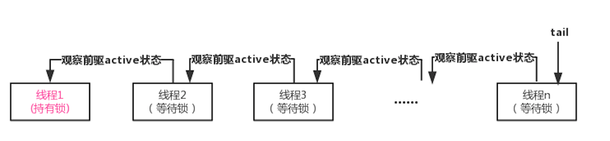
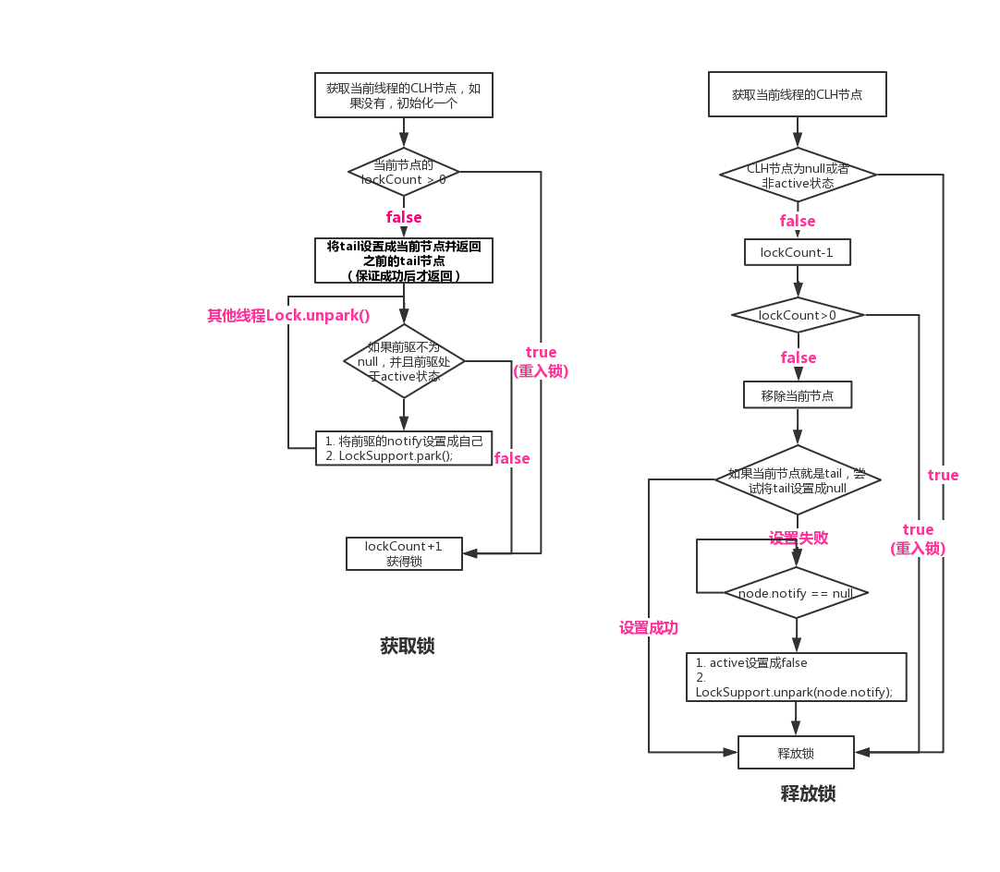
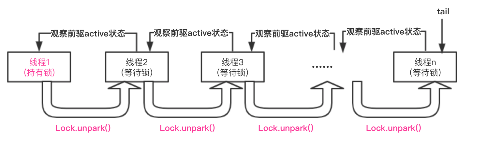

参考： 
1. https://blog.csdn.net/dm_vincent/article/details/79842501
2. https://blog.csdn.net/dm_vincent/article/details/79783104

非公平的自旋锁还是公平的自旋锁，由于执行线程均在同一个共享变量上自旋，申请和释放锁的时候必须对该共享变量进行修改，这将导致所有参与排队自旋锁操作的处理器的缓存变得无效，频繁的缓存同步操作会导致繁重的系统总线和内存的流量，从而大大降低了系统整体的性能。MCS和CLH锁能够让执行线程不再在同一个共享变量上自旋，避免过高频率的缓存同步操作。

## CLH
CLH(Craig, Landin and Hagersten)锁是一种基于链表的可扩展、高性能、公平的自旋锁，申请线程只在本地变量上自旋，**它不断轮询前驱的状态**，如果发现前驱释放了锁就结束自旋。

每个等待锁或者持有锁的线程，内部都持有一个CLHNode：
active表示是否已经释放锁，如果已经释放锁active=false，如果持有锁或者等待锁active=true。lockCount表示加锁的次数，可以支持重入功能。

```java
    /**
     * CLH锁节点状态
     * 每个希望获取锁的线程都被封装为一个节点对象
     */
    private static class CLHNode {

        /**
         * 默认状态为true
         */
        volatile boolean active = true;

        /**
         * 用来lock()的次数
         */
        int lockCount = 0;

    }
```

CLH 对象保存一个CLHNode类型的tail，当新节点请求加锁时，需要把tail设置成自己
更新tail使用原子更新器AtomicReferenceFieldUpdater

```java
   /**
     * 隐式链表最末等待节点
     */
    private volatile CLHNode tail = null;
    
    /**
     * 原子更新器
     */
    private static final AtomicReferenceFieldUpdater<CLH, CLHNode> UPDATER = AtomicReferenceFieldUpdater
            .newUpdater(CLH.class, CLHNode.class, "tail");

```

整个CLH流程如下图：


CLH等待锁的链表是一个隐式链表，用一个tail节点指向最新加入等待锁的线程，这个隐式链表中每个线程都在观察自己的前驱active状态变成false，否则一直等待。



## CLH代码

```java
// TODO:
```

## 改进后的CLH
前面代码中可以看出，等待前驱释放锁的过程中，当前线程已经在自旋等待，在竞争很小的情况下，确实可以减少线程上下文切换，但是当竞争很激烈时，cpu的消耗很大。
一种在竞争激烈情况下的改进是，当前线程获取不到锁时，阻塞自己，当前驱释放锁时，唤醒自己。
java中Lock.park()和Lock.unpark()提供了阻塞和唤醒的语义。

改进后的CLH节点增加一个 Thread 类型的 notify 字段，表示当前节点释放锁时，如果后续有节点等待（tail不是自己），需要唤醒notify这个线程。

改进后的CLH流程如下图：


隐式链表变成：




## 改进后的CLH代码

```java
//TODO:
```


## MCS(John Mellor-Crummey and Michael Scott)

MCS自旋锁是一种基于单向链表的高性能、公平的自旋锁，申请加锁的线程只需要在本地变量上自旋，**直接前驱负责通知其结束自旋**，从而极大地减少了不必要的处理器缓存同步的次数，降低了总线和内存的开销。