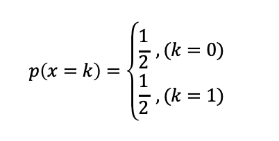

# 基数估计算法

基数估计算法可以先从 [codinglabs](http://blog.codinglabs.org/articles/cardinality-estimation.html) 这个链接中看下基本概念。

## 概念

简单来说，基数（cardinality，也译作势），是指一个集合（这里的集合允许存在重复元素，与集合论对集合严格的定义略有不同，如不做特殊说明，本文中提到的集合均允许存在重复元素）中不同元素的个数。例如看下面的集合：

{1,2,3,4,5,2,3,9,7}
这个集合有9个元素，但是2和3各出现了两次，因此不重复的元素为1,2,3,4,5,9,7，所以这个集合的基数是7。

如果两个集合具有相同的基数，我们说这两个集合等势。基数和等势的概念在有限集范畴内比较直观，但是如果扩展到无限集则会比较复杂，一个无限集可能会与其真子集等势（例如整数集和偶数集是等势的）。不过在这个系列文章中，我们仅讨论有限集的情况，关于无限集合基数的讨论，有兴趣的同学可以参考实变分析相关内容。

以上内容完全抄自 [codinglabs](http://blog.codinglabs.org/articles/cardinality-estimation.html)

假设基数上限：100000000（10^8)

## BitMap

**非概率算法，空间复杂度：O(Nmax)**

举例：
100，000，000bit=12.5*1000，1000B约等于12.5MB

这个算法很简单，比如集合中有(1,1,2,2,5,6,6)，那么基数就是1，2，5，6=4个
用bitmap表示，就是在bit数组中的1，2，5，6位置止为1

## Liner Counting
//TODO:需要高超的概率论和数理统计知识，暂时无法推导

可以参考[wbin233在csdn的博客](https://blog.csdn.net/wbin233/article/details/78752597)

## LogLog Counting

LLC 部分主要参看文章：
[codinglabs](http://blog.codinglabs.org/articles/algorithms-for-cardinality-estimation-part-iii.html)
[csdn](https://blog.csdn.net/firenet1/article/details/77247649)

**概率算法，空间复杂度：O(log2(log2(Nmax)))**

举例：
todo:

取一个hash函数H，应用于每一个元素，然后对hash值进行基数估计，对hash的要求：

1、H的结果具有很好的均匀性，也就是说无论原始集合元素的值分布如何，其哈希结果的值几乎服从均匀分布（完全服从均匀分布是不可能的，D. Knuth已经证明不可能通过一个哈希函数将一组不服从均匀分布的数据映射为绝对均匀分布，但是很多哈希函数可以生成几乎服从均匀分布的结果，这里我们忽略这种理论上的差异，认为哈希结果就是服从均匀分布）。
2、H的碰撞几乎可以忽略不计。也就是说我们认为对于不同的原始值，其哈希结果相同的概率非常小以至于可以忽略不计。
3、H的哈希结果是固定长度的。

根据1，2，3可以简单的有几下结论：

- 假设有元素a，那么hash之后的值为ha
因为长度为定长（第3点要求），假设hash之后L，任意位置用k表示，显然k的取值范围[1, L], ha用二进制表示下，如：

- 因为hash函数有很好的均匀性，所以二进制表示中，每个位置出现0和1的概率相同：

p(x)表示表示第一次出现1的概率, 1<=x<=L
那么第k个位置第一次出现1的概率为 p(x=k)=(0.5)^k

这个场景可以用投掷硬币来模拟：
抛硬币：
1）出现正反面的概率都是1/2，
2）一直抛硬币直到出现正面，记录下投掷次数k，但最多只能扔L次
这种实验做n次独立重复实验，并记录下第一次出现正面是投掷次数ki，i=[1,2,...,n]，n次实验投掷次数为ki=[k1,k2,...,kn]

寻找第一次出现1个过程是一个伯努利过程，求解一下2个问题：

**进行n次伯努利过程，所有投掷次数都不大于K的概率是多少？**

某一次波努力过程，投掷次数都不大于K的概率：

n次波努力过程是n次独立事件，所以概率：

有以下结论：

**进行n次伯努利过程，至少有一次投掷次数等于K的概率是多少？**

p(至少有一次投掷次数等于K的概率) = 1-p(没有一次等于K)

在当前分析的场景中，就是都小于K（因为连K次都没到就出现1了，就不可能有K+1,K+2等的出现），即p(至少有一次投掷次数等于K的概率) = 1-p(所有投掷都小于K)

某一次波努力过程，投掷次数都不大于K的概率：

所有投掷都小于k的概率：

至少有一次投掷次数等于K的概率：

有以下结论：

**文字概括就是：当次数n远大于2^K时，没有一次投掷次数大于K的概率为0；当次数n远小于2^K时，至少有一次过程投掷次数等于K的概率为0**

如果将上面描述做一个对应：一次伯努利过程对应一个元素的比特串，反面对应0，正面对应1，投掷次数k对应第一个“1”出现的位置，我们就得到了下面结论：

设一个集合的基数为L，kmax为所有元素中首个1的位置最大的那个元素的1的位置，如果L远远小于2^kmax，则我们得到kmax为当前值的概率几乎为0（它应该更小），同样的，如果L远远大于2^kmax，则我们得到kmax为当前值的概率也几乎为0（它应该更大），因此2^kmax可以作为基数n的一个粗糙估计。(疑问：为什么是最大值来做估计？)

## HyperLogLog Counting

和LogLog Counting 对比
[看这里](http://content.research.neustar.biz/blog/hll.html)

